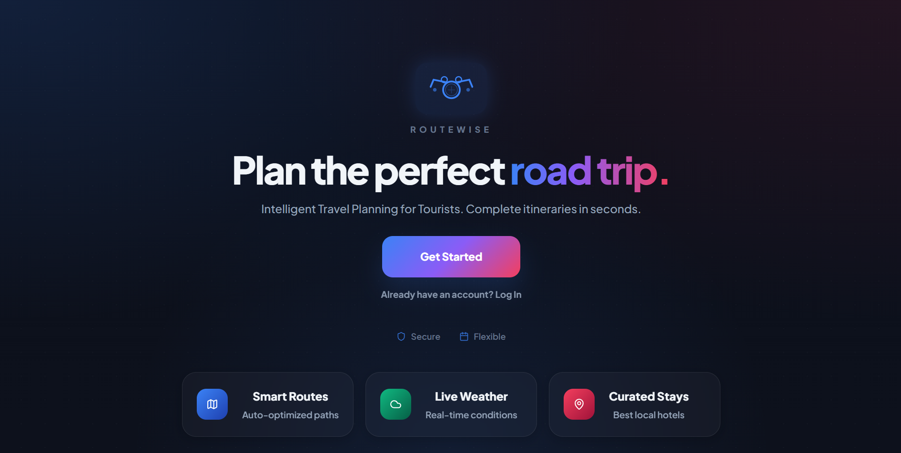
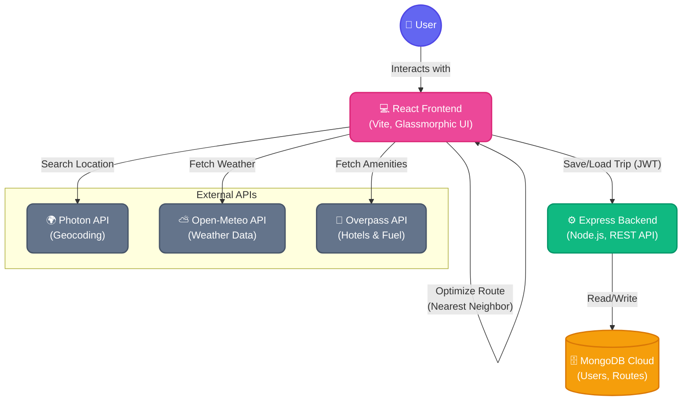
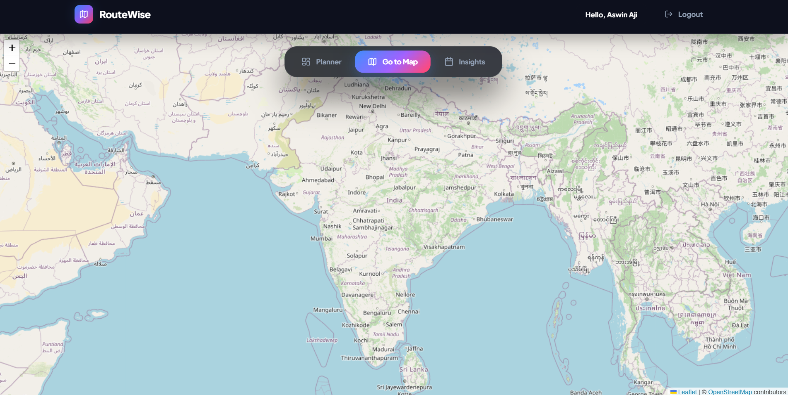
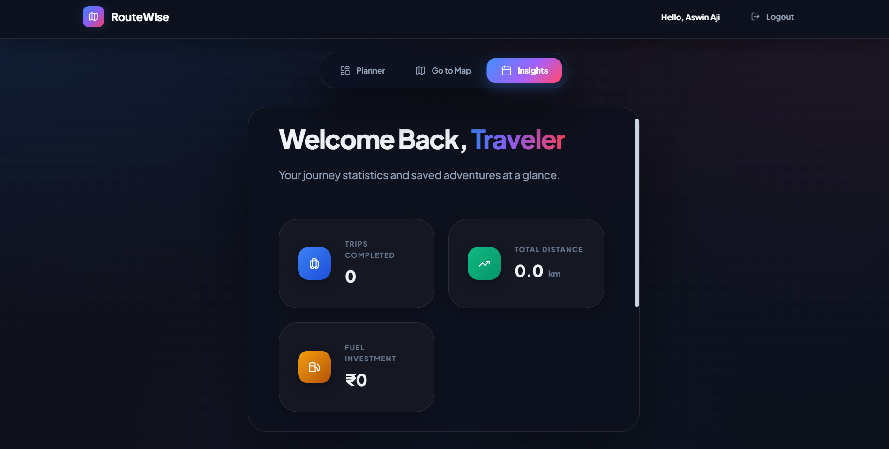

<div align="center">
  
  
  # 🗺️ RouteWise - Intelligent Route Optimizer

  **Plan the perfect road trip with smart optimization, live weather, and curated stays.**

  [](https://reactjs.org/)
  [](https://nodejs.org/)
  [](https://expressjs.com/)
  [](https://www.mongodb.com/)
  [](https://tailwindcss.com/)
</div>

<br />

## 🌟 Overview

**RouteWise (Route Optimizer)** is a full-stack web application designed for tourists and travelers to create the most efficient and cost-effective road trip itineraries. By leveraging the **Nearest Neighbor Algorithm** along with real-time APIs for geocoding, weather forecasts, and nearby amenities (hotels & fuel stations), RouteWise takes the hassle out of trip planning.

---

## ✨ Key Features

- 📍 **Smart Route Optimization:** Automatically reorders your destinations to find the shortest and most efficient path using the Nearest Neighbor algorithm.
- ⛅ **Real-time Weather Insights:** Fetches live weather conditions and temperature for each stop on your journey.
- 🏨 **Curated Stays & Fuel Stations:** Discover nearby hotels and petrol pumps around your destinations.
- 🚙 **Fuel Cost Estimation:** Calculates the estimated fuel cost based on your vehicle's mileage and current fuel prices.
- 🗺️ **Interactive Map View:** Visualize your entire journey on an interactive map powered by Leaflet and OpenStreetMap.
- 🔐 **Secure Authentication:** User registration and login powered by JSON Web Tokens (JWT) and bcrypt.
- 💾 **Save & Load Trips:** Persist your favorite itineraries to the cloud and access them anytime from your personalized dashboard.
- 📱 **Responsive Glassmorphic UI:** A premium, immersive interface that works beautifully across all devices.

---

## 🏗️ System Architecture & Data Flow



---

## 🚀 How Route Optimization Works

```mermaid
sequenceDiagram
    autonumber
    actor User
    participant App as React Frontend
    participant Opt as Optimizer Engine
    participant API as External APIs
    
    User->>App: Clicks "Optimize Route"
    App->>Opt: Passes List of Stops
    note right of Opt: Calculates Haversine distances<br/>between all stops
    Opt->>Opt: Applies Nearest Neighbor Algorithm
    Opt-->>App: Returns Reordered Stops
    
    par Data Enrichment
        App->>API: Fetch Weather (Open-Meteo)
        App->>API: Fetch Hotels (Overpass)
        App->>API: Fetch Fuel Stations (Overpass)
    end
    API-->>App: Returns enriched data
    
    App-->>User: Displays Final Interactive Itinerary & Map
```

---

## 📸 Application Screenshots

### 1. The Trip Planner Dashboard
<div align="center">
  
</div>

### 2. Interactive Map View
<div align="center">
  
</div>

### 3. Trip Insights & Metrics
<div align="center">
  
</div>

---

## 🛠️ Tech Stack

### Frontend
- **Framework:** React.js (built with Vite)
- **Styling:** Custom CSS (Glassmorphic Design System)
- **Maps:** Leaflet.js (`react-leaflet`)
- **Icons:** Lucide-React
- **State Management:** React Context API

### Backend
- **Runtime:** Node.js
- **Framework:** Express.js
- **Database:** MongoDB (Mongoose ODM)
- **Authentication:** JSON Web Tokens (JWT), bcryptjs

### APIs Used
- [Photon API](https://photon.komoot.io/) - For geocoding and location search autocompletion.
- [Open-Meteo](https://open-meteo.com/) - For real-time weather forecasts.
- [Overpass API (OSM)](https://wiki.openstreetmap.org/wiki/Overpass_API) - For querying nearby hotels and fuel stations.

---

## 💻 Installation & Local Setup

Follow these steps to get the project up and running on your local machine.

### Prerequisites
- Node.js (v18+)
- MongoDB (Local instance or MongoDB Atlas cluster)

### 1. Clone the repository
```bash
git clone https://github.com/SWINNNNNN/Route-Optimizer.git
cd Route-Optimizer
```

### 2. Backend Setup
```bash
cd Backend
npm install

# Create a .env file in the Backend directory with:
# PORT=5000
# MONGO_URI=your_mongodb_connection_string
# JWT_SECRET=your_super_secret_key

# Start the development server
npm run dev
```

### 3. Frontend Setup
```bash
# Open a new terminal window
cd Frontend
npm install

# Start the development server
npm run dev
```

### 4. View in Browser
Open [http://localhost:5173](http://localhost:5173) in your browser.

---

## 📜 License

This project is created for educational purposes as a part of a Minor Project for the MCA curriculum at MACE.

---
<div align="center">
  <i>Developed with ❤️ for intelligent travel planning.</i>
</div>
